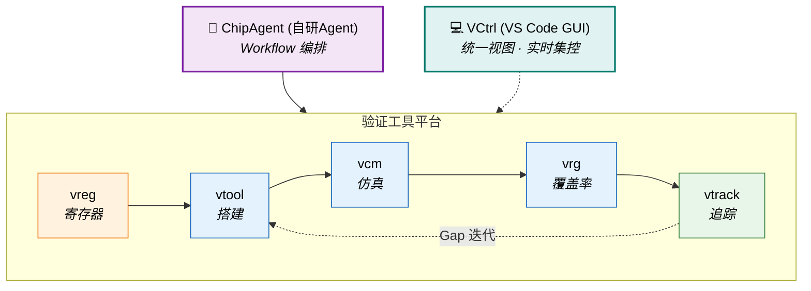

<div align="center">

# 👋 你好，我是 John

**数字 IC 验证工程师 / Digital IC Verification Engineer**

杭州 · 5 年经验 · Hangzhou · 5 Years Experience

*用 UVM 验证芯片，用 Python 造工具，用 AI 探索 EDA 新范式*

[](mailto:johnmc104@qq.com)
[](https://github.com/Johnmc104)

</div>

---

## 关于我

我是一名数字 IC 验证工程师，日常负责 SoC 功能验证的全流程任务：搭建 UVM 环境、开发用例、执行回归、收敛覆盖率并定位 Bug。

在常规的验证主线之外，我致力于探索效率的上升边界，持续推进两项实践：

1. **全栈工具链开发**：围绕验证全生命周期，独立开发并落地了 VCM（仿真管理）、VRG（覆盖率分析）、vtrack（验证追踪）、VReg（寄存器平台）与 vtool（命令行工具集）五套核心工具，实现了从仿真执行到追踪闭环的流程自动化。
2. **探索 AI 驱动工作流**：在底层工具的基础上研发了终端 AI Agent 框架 —— ChipAgents。它将散落的 CLI 工具重新编排为 AI 驱动的自动化工作流，实现了“从 Spec 解析到环境搭建”的端到端对话式交付。

为建立从 RTL 到 GDSII 的全局物理视野，我尝试自建了涵盖综合、布局布线及签核的完整后端流程框架（chip_flow），并在数个开源 SoC 上跑通。

> I am a Digital IC Verification Engineer building UVM testbenches and robust verification automation toolchains. Beyond traditional DV tasks, I have developed ChipAgents — an LLM-based agent framework that orchestrates fragmented EDA tools into AI-driven workflows, transforming chip verification from manual routines into intelligent, end-to-end conversations.

---

## 技术栈

<table>
<tr>
<td valign="top" width="50%">

**验证 / Verification**
- `UVM` (VCS / Xcelium) · `SystemVerilog` 断言 & 覆盖率
- Synopsys `Verdi` 调试 · NPI 编程接口
- Synopsys VIP (SVT APB/SPI Agent) · `OVL`
- `SpyGlass` Lint / CDC / Low Power

**后端 / Backend Flow**
- Synopsys: DC · ICC2 · FC · RTLA · PT · FM · DSO.ai
- Cadence: Innovus · Xcelium
- 开源: OpenROAD · OpenLane · Yosys

</td>
<td valign="top" width="50%">

**语言与开发 / Languages**
- `SystemVerilog` · `Verilog` · `Tcl` · `Shell`
- `Python` · `C/C++` · `TypeScript`
- `React` · `FastAPI` · `SQLite`
- `SystemRDL` · `ANTLR` · `LaTeX`

</td>
</tr>
</table>

---

## 验证工具生态

从手动工具到前端视窗，再到 AI 编排——七套工具组成完整的验证自动化栈：



| 层 | 工具 | 职责 |
|---|------|------|
| **AI 编排** | ChipAgent | Playbook 阶段编排，驱动下层工具完成端到端流程 |
| **IDE 集成** | VCtrl | VS Code 原生扩展，将 CLI 工具链图形化与可视化 |
| **工具平台** | vreg · vtool · vcm · vrg · vtrack | 寄存器定义 · 项目搭建 · 仿真管理 · 覆盖率分析 · 验证追踪 |

---

### 🤖 ChipAgent — AI 驱动的 EDA 终端助手

ChipAgent 是一款专为芯片设计全流程打造的终端 AI 助手。它基于 Deep Agents（LangChain 生态）构建，旨在部署于网络隔离的 EDA（电子设计自动化）服务器环境中。只需确保 LLM API 连通，即可在终端运行。

与市面上通用的 AI 编程助手（如 Copilot 或 Claude Code）不同，ChipAgent 的核心定位是解决芯片设计中**可规范化、可重复执行的流程任务**。

#### 🌟 核心应用场景

它能够协助芯片工程师处理日常繁杂的底层任务，包括：
- 仿真调试与排错
- 逻辑综合
- 日志分析
- 开发环境搭建
- EDA 工具的专业知识问答

#### ✨ 关键特性

| 核心特性 | 说明与价值 |
|---|---|
| **三层 EDA 知识体系** | 采用 YAML 和 Markdown 驱动的“岗位(Position) → 事项(Playbook) → 知识(Skill)”三层模型|
| **原生 CI 集成（管道）** | 支持无缝嵌入自动化仿真脚本（如 `-c "查询" -e -o report.md`） |
| **安全与权限把控** | 具备四级风险划分策略，结合 LLM 分类器与“人类在环（HITL）”审批机制|
| **跨层记忆与复盘系统** | 实现项目级、用户级、会话级三层记忆，支持 AI 召回跨会话迁移；提供会话追踪（`trace.jsonl`）以供事后复盘 |

#### 🛠️ 技术与工程设计

- **开发核心**：Python ≥ 3.11，使用先进的 `uv` 作为包与环境管理器。
- **多模型兼容**：支持通过配置文件一键切换 OpenAI、Anthropic、Google GenAI 等主流大模型服务。
- **代码规模**：项目整体达 3.1 万余行，包含灵活的组件工厂、阶段编排状态机、19 个核心组件，以及 1911 个高质量测试用例。

---

### 🛠️ 验证底层平台矩阵 (Tool Platform)

在开发 AI Agent 之前，我打磨了五个关键的底层架构系统，它们既服务于人工日常操作，同时也作为 Native Tools 支撑大模型的自主调用。

#### 🔗 vtrack — 验证需求追踪系统

基于 Feature→VP→Case 三层模型的验证追踪工具，连接功能需求与测试执行的完整可追溯链路。

| 核心特性 | 说明与价值 |
|---|---|
| **层次化追踪** | 建立 Feature → VP (验证点) → Case 的多对多直接追溯与映射关系 |
| **覆盖率与结果同步** | 直接对接 VCM 仿真结果与 VRG，自动同步功能覆盖率数据 (`sync vcm/vrg`) |
| **GAP 缺口分析** | 智能识别未覆盖功能点、无用例验证点及失败用例，支持多级过滤分析 |
| **矩阵与快照追踪** | 自动生成 Feature×VP×Case 三维追踪矩阵，通过验证快照监控收敛趋势 |

**典型工作流**：
```bash
vtrack init pcie_ctrl --project GP28
vtrack feature add "LTSSM 状态机" --group "链路训练" --priority P0
vtrack vp add "状态遍历" --features F001 --method directed
vtrack case add "ltssm_walk" --vp VP001
vtrack matrix --group "链路训练"    # 追踪矩阵
vtrack gap --priority P0           # 覆盖率缺口
```

支持 Human / JSON / YAML 多格式输出，同时服务于工程师手动操作和 ChipAgent AI 工具调用。

#### 📋 vreg — 全功能寄存器管理平台

芯片寄存器定义、管理与多格式代码生成的一站式平台。

| 核心特性 | 说明与价值 |
|---|---|
| **全栈式前后端** | 前端 React + Vite，多功能富文本编辑与可视化；后端 FastAPI + SQLite 构建强权限系统 |
| **多态生成引擎** | 内嵌 SystemRDL 并自动编译，输出一揽子 UVM Model、RTL、C Header 及覆盖率模型 |
| **重叠位域检测** | 智能校验地址或位宽等潜在物理重叠冲突错点并执行 32/64位锁定防并发 |
| **复杂 Excel 互通** | 支持宏定义、复杂数级导入生成，解决版本与数据溯源的一揽子开发成本 |

#### 🛠️ vtool — DV 命令行工具集

部署于 EDA 服务器的一站式验证辅助工具，统一入口 `vtool -<option>`。

| 核心特性 | 说明与价值 |
|---|---|
| **一键式 UVM 骨架** | 分类生成模块 / 系统级验证层次 (`-init bt\|st`) 及各类组件 (`-c agent\|env`) |
| **混合运行管理** | 用例动态扫描，生成 EMC (环境多构建) 回归列表，自动查库、解析及重跑时序 |
| **测试日志提纯** | 识别仿真报错或断言触发，自动导出 Markdown 回归 Bug 报告以进行 Issue 定位 |
| **代码解析溯源** | 支持全代码库内搜索组内、类名并一键导出，支持火焰图转换及静态参数生成 |

内置 svlib + OVL 库引用。

#### 📊 vcm — 验证用例管理系统

面向数字验证仿真流程的全生命周期管理系统。`v1.5.0`

| 核心特性 | 说明与价值 |
|---|---|
| **自适应读写引擎** | CLI 双环境感知：后端直连 Flask API；无网络可降级本地 SQLite 并呈现离线报告 |
| **单例仿真全托管** | 采集编译日志、仿真种子及其通过状态等参数，对任一错误执行一键 Verdi 再现 |
| **回归切分与集群监控** | Slurm 批量提交及轮询，整合用例集、结果矩阵统计与测试异常回归报告 |
| **多工艺覆盖角配置** | 管理多构建下的 EMC 并执行自动化构建拉取 (Make) 及校验 (Check) 闭环 |

**典型场景：**
- **单次仿真**：`vcm task add` → `vcm sim add_basic_single` — 自动采集编译信息、仿真日志、种子、用例名、通过状态
- **集群回归**：Slurm 批量提交 → 状态查询 → 结果统计 → 报告生成
- **EMC 多 Build**：多工艺角 test-build 映射、编译命令自动获取
- **一键调试**：`vcm info sim <id>` 直接启动 Verdi

#### 📈 vrg — VDB 覆盖率分析引擎

Synopsys VDB 覆盖率数据库的解析与报告工具，支持用例级覆盖率归因分析。

| 核心特性 | 说明与价值 |
|---|---|
| **VDB 二进制直读** | `Synopsys C lib` 嵌入原生解析层引擎进行全覆盖率无损直接重组 |
| **测试粒度精准指认** | 按任一特定 Testcase 的归因溯源与统计覆盖贡献权重并排除冗余 case |
| **七维覆盖率引擎** | 原生提取 `Line/Branch/Condition/Toggle/FSM/Assert/Group` 并多格式输出 |
| **多源自适应同步** | 脱离 VDB API 时智能解析提取的远端 JSON，通过 `vtrack` 自动化推流同步 |

**核心能力**：
- 按用例粒度归因覆盖率贡献，识别冗余 case
- 双数据源：VDB 直连 / JSON 报告，按环境自动切换
- 与 vtrack 联动：`vtrack sync vrg` 自动同步覆盖率至追踪系统

#### 💻 VCtrl — VS Code 验证控制中心

将验证工作流（`vtool`、`vcm`、`vrg`、`vtrack`）直接集成到代码编辑器中的 VS Code 原生扩展。

| 核心特性 | 说明与价值 |
|---|---|
| **全景数据仪表盘** | 内联统计用例及验证点覆盖数，快速直角呈现通过率以及优先级状态 |
| **测试计划(VPlan)视图** | 可视化缺口分析编辑矩阵，无缝化实现 Feature → Case 全生命周期追溯 |
| **实时仿真面板** | GUI 并发调用内部 `vcm` 联合集群状态实时监控进程运行、及 `Seed` 拉取等行为 |
| **智能重组与错误捕获** | 根据 `Data fail` 参数抽取报错点回归重启并智能调用 Verdi 环境下进行调试 |
| **两级缓存底座** | 阻断式防止界面进程冻结并内存级复用终端执行信号机制，确保用户无感 |

通过可视化的面板与树状视图组件，极大简化了终端敲击命令的繁琐过程，并以所见即所得的方式完成回归测试配置和审查追踪。

---

## 更多效率工具

| 工具 | 功能 | 技术 |
|------|------|------|
| **tool_cov** | Verdi/VCS 覆盖率提取 → Excel 报告 | NPI + Python |
| **tool_wave** | FSDB 波形读取 + 网表 signal driver/load 追踪 | Verdi NPI · C/S 架构 |
| **tool_soc** | IP-XACT SoC 自动互联 → RTL / C Header / Device Tree | Python 3.11+ |
| **tool_clkrst_network** | 时钟复位网络可视化设计 → Verilog 导出 | React + ReactFlow |
| **tool_disasm_8051** | 8051 固件反汇编 · 跳转分析 · 内存利用率 | Python |
| **python_tool** | spec2rdl · spec2xlsx · json2docx · pinmux · IO list · 工时报告 | Python 脚本集 |

---

## 后端全流程框架

### chip_flow

Makefile 驱动的 Synopsys 数字后端流程，覆盖 RTL 到签核，用于拉通全链路理解。

- **7 工具**：RTLA → DC → ICC2 → FC → DSO.ai → FM → PT
- **3 条路径**：DC→ICC2→FM→PT / FC 统一 / DSO 优化
- **4 层分离**：PDK / 设计 / 公共 / 工具脚本 — 支持 SAED32 / TSMC40 / SAED14 多工艺
- 已在 servant (RISC-V)、m0plus_top (ARM) 上验证全流程

---

## 开源项目

| 项目 | 描述 |
|------|------|
| [hvp-language-support](https://github.com/Johnmc104/hvp-language-support) | VSCode 插件：层次化验证计划语法支持 (TypeScript) |
| [sdc-xdc-support](https://github.com/Johnmc104/sdc-xdc-support) | VSCode 插件：SDC/XDC 时序约束支持 (TypeScript) |
| [reg_tool_manage](https://github.com/Johnmc104/reg_tool_manage) | SystemRDL 寄存器管理流程 (Python) |
| [sv_parser](https://github.com/Johnmc104/sv_parser) | 基于 ANTLR 的 SystemVerilog 解析器 |

---

## 技术写作

基于 LaTeX (elegantbook) 编写：

**书籍**：SoC 功能验证 · ASIC 设计与综合 · 低功耗与存储管理 · ECC 密码学 · 物理设计

**手册**：Design Compiler · Fusion Compiler · 数字验证 · Git 工作流 · Tcl Workshop

---

## 🚀 未来焦点

我的技术探索依然聚焦于提升芯片验证环境的工程效率极限：

1. **Agent 能力边界的跃迁**：从目前中小型模块层级的验证，向上拓展并适配更大规模、更高复杂度的异构 SoC 验证场景。
2. **构建无人值守的闭环修复流**：深度耦合现有工具平台链，实现基于“仿真报错 / 漏覆盖”等强逻辑场景的 `Debug → Fix → Verify` 纯自动化自治循环链条。

---

<div align="center">

*"用严谨的思路构建高品质环境，用智能的编排消散碎片化劳作"*

</div>
