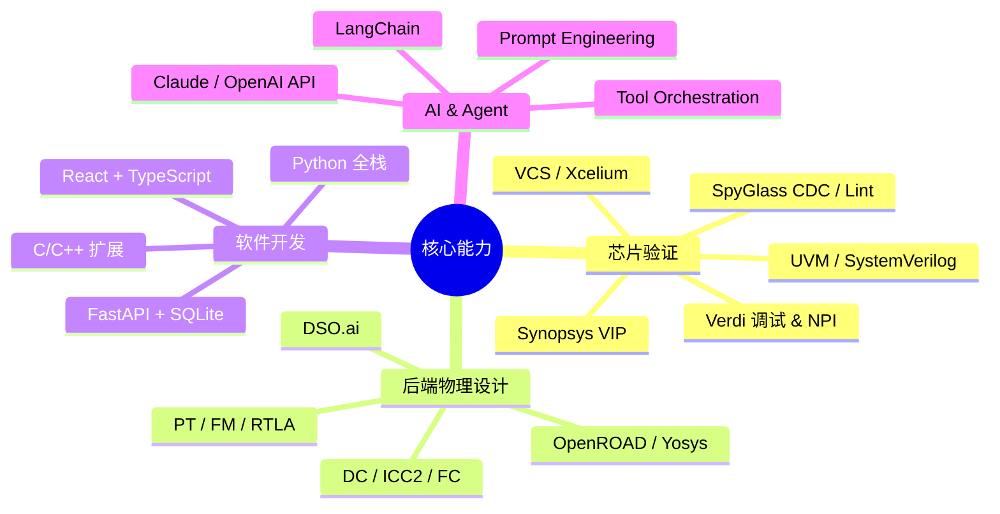
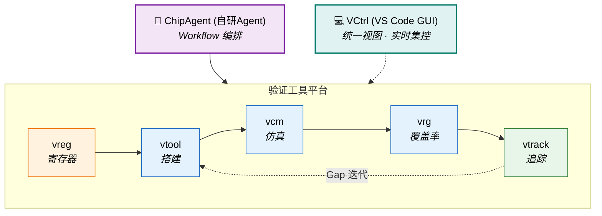
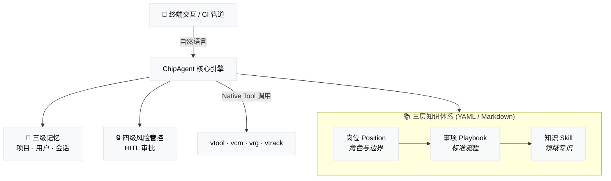
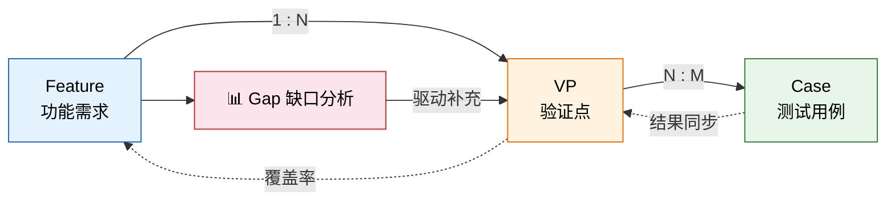
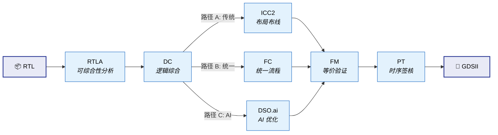

<div align="center">

# 👋 你好，我是 John

**数字 IC 验证工程师 / Digital IC Verification Engineer**

杭州 · 5 年经验 · Hangzhou · 5 Years Experience

*用 UVM 验证芯片，用 Python 造工具，用 AI 探索 EDA 新范式*

[](mailto:johnmc104@qq.com)
[](https://github.com/Johnmc104)

</div>

---

## 关于我

我是一名数字 IC 验证工程师，日常工作围绕 SoC 芯片的功能验证展开——搭建 UVM 环境、编写测试用例、执行回归仿真、推动覆盖率收敛，以及定位和修复设计缺陷。

在完成验证主业的同时，我持续投入两个方向的探索：

1. **全栈工具链开发**：针对验证生命周期中的效率瓶颈，独立设计并落地了五套核心工具——VCM（仿真管理）、VRG（覆盖率分析）、vtrack（验证追踪）、VReg（寄存器平台）和 vtool（命令行工具集），覆盖了从仿真执行到追踪闭环的完整链路。
2. **AI 驱动的验证工作流**：在工具链的基础上，研发了终端 AI Agent 框架——ChipAgent。它将零散的命令行工具编排成 AI 可驱动的自动化流程，让"从 Spec 解析到环境搭建"可以通过自然语言对话完成。

此外，为了建立从 RTL 到 GDSII 的全局物理视野，我自建了一套覆盖综合、布局布线与签核的完整后端流程框架（chip_flow），并在多个开源 SoC 上跑通验证。

> I am a Digital IC Verification Engineer building UVM testbenches and robust verification automation toolchains. Beyond traditional DV tasks, I have developed ChipAgent — an LLM-based agent framework that orchestrates fragmented EDA tools into AI-driven workflows, transforming chip verification from manual routines into intelligent, end-to-end conversations.

---

## 技术栈



<table>
<tr>
<td valign="top" width="50%">

**验证 / Verification**
- `UVM` (VCS / Xcelium) · `SystemVerilog` 断言 & 覆盖率
- Synopsys `Verdi` 调试 · NPI 编程接口
- Synopsys VIP (SVT APB/SPI Agent) · `OVL`
- `SpyGlass` Lint / CDC / Low Power

**后端 / Backend Flow**
- Synopsys: DC · ICC2 · FC · RTLA · PT · FM · DSO.ai
- Cadence: Innovus · Xcelium
- 开源: OpenROAD · OpenLane · Yosys

</td>
<td valign="top" width="50%">

**语言与开发 / Languages**
- `SystemVerilog` · `Verilog` · `Tcl` · `Shell`
- `Python` · `C/C++` · `TypeScript`
- `React` · `FastAPI` · `SQLite`
- `SystemRDL` · `ANTLR` · `LaTeX`

**AI 与 Agent / AI & Agent**
- `LangChain` · `Deep Agents` 生态
- `Claude` · `OpenAI` · `Google GenAI` 多模型接入
- YAML/Markdown 驱动的知识编排体系
- 终端 Agent 安全策略与记忆系统

</td>
</tr>
</table>

---

## 验证工具生态

从手动工具到前端视窗，再到 AI 编排——七套工具组成完整的验证自动化栈：



| 架构分层 | 核心组件 | 定位与核心职责 |
|---|---|---|
| **🤖 AI 编排层** | **ChipAgent** | AI 编排中心。通过结构化 Playbook 驱动底层工具，将验证任务串联成端到端的自动化流程。 |
| **💻 视窗交互层** | **VCtrl** | IDE 控制台。以 VS Code 扩展形式，将分散的命令行工具统一为可视化交互界面，支持一键操作。 |
| **🔗 需求追踪层** | **vtrack** | 验证追踪系统。管理 Feature → VP → Case 三层追溯链路，对外提供缺口分析接口。 |
| **📋 资产定义层** | **vreg** | 寄存器管理平台。可视化编辑硬件寄存器定义，自动检测位域冲突，一键生成 RTL、UVM 和 C 驱动代码。 |
| **🛠️ 开发脚手架层** | **vtool** | 命令行工具集。提供丰富的子命令，覆盖 UVM 项目骨架生成、代码检索比对、回归用例扫描与收集。 |
| **📊 执行调度层** | **vcm** | 仿真管理系统。统管单次仿真与 SLURM 集群回归，处理多工艺角 EMC 自动化构建与调度。 |
| **📈 覆盖分析层** | **vrg** | 覆盖率分析引擎。通过内置 C 层引擎直接解析 VDB 数据库，实现用例级覆盖率归因、增量分析与冗余识别。 |

---

### 🤖 ChipAgent — AI 驱动的 EDA 终端助手

ChipAgent 是一款专为芯片设计全流程打造的终端 AI 助手。它基于 Deep Agents（LangChain 生态）构建，设计目标是部署在网络隔离的 EDA 服务器环境中——只需 LLM API 可达，即可在终端运行。

与 Copilot 或 Claude Code 等通用编程助手不同，ChipAgent 的核心定位是解决芯片设计中**可规范化、可重复执行的流程任务**。它不追求通用代码生成，而是把标准化的 EDA 操作流程沉淀为可被 AI 理解和驱动的知识结构。



#### 🌟 核心应用场景

ChipAgent 面向的是芯片工程师日常重复度高但步骤繁杂的底层任务：

| 场景 | 说明 | 典型指令示例 |
|------|------|------|
| **仿真调试** | 自动解析编译/仿真错误日志，定位根因并给出修复建议 | `帮我分析这个仿真的报错` |
| **逻辑综合** | 驱动 DC 综合流程，解读 timing/area 报告 | `综合 uart_ctrl 并检查 timing` |
| **日志分析** | 批量提取回归日志中的关键异常模式 | `分析上一轮回归的失败用例` |
| **环境搭建** | 自动创建 UVM 验证环境骨架与组件文件 | `为 spi_master 创建验证环境` |
| **知识问答** | 即时回答 EDA 工具配置、方法学与调试技巧 | `VCS 的 -debug_access 有什么区别` |

#### ✨ 关键特性

| 核心特性 | 说明与价值 |
|---|---|
| **三层 EDA 知识体系** | YAML/Markdown 驱动的"岗位 → 事项 → 知识"三层模型，将 EDA 经验结构化为 AI 可检索、可执行的知识库 |
| **原生 CI 集成（管道）** | 支持嵌入自动化脚本（如 `-c "查询" -e -o report.md`），可无缝融入已有仿真流水线 |
| **安全与权限把控** | 四级风险划分策略，结合 LLM 分类器与"人类在环（HITL）"审批机制，确保危险操作可控 |
| **跨层记忆与复盘系统** | 项目级、用户级、会话级三层记忆，支持 AI 跨会话知识迁移；配合 `trace.jsonl` 实现事后复盘 |

#### 🛠️ 技术与工程设计

| 维度 | 详情 |
|------|------|
| **开发语言** | Python ≥ 3.11，使用 `uv` 管理包与虚拟环境 |
| **多模型支持** | 配置文件一键切换 OpenAI、Anthropic、Google GenAI 等主流 LLM |
| **工程规模** | 3.1 万余行代码，19 个核心组件，1911 个测试用例 |
| **核心架构** | 组件工厂 + 阶段编排状态机，支持灵活的 Workflow 扩展 |

---

### 🛠️ 验证底层平台矩阵 (Tool Platform)

在构建 AI Agent 之前，我首先打磨了五个底层工具系统。它们既服务于工程师的日常手动操作，也作为 Native Tools 供大模型自主调用——这种"人机共用"的设计，让工具链天然具备了 AI 就绪的能力。

| 工具 | 定位 | 技术栈 | 输出格式 |
|------|------|------|------|
| **vtrack** | 验证追踪 | Python CLI | Human / JSON / YAML |
| **vreg** | 寄存器管理 | React + FastAPI + SQLite | RTL / UVM / C Header |
| **vtool** | 开发脚手架 | Python CLI · svlib + OVL | UVM 骨架 / Markdown 报告 |
| **vcm** | 仿真管理 | Python CLI + Flask API | 报告 / Verdi 调试 |
| **vrg** | 覆盖率分析 | Python + Synopsys C lib | 七维覆盖率报告 |

#### 🔗 vtrack — 验证需求追踪系统

vtrack 基于 Feature → VP → Case 三层模型，在功能需求与测试执行之间建立完整的可追溯链路。它是验证闭环的"最后一公里"——当覆盖率数据和仿真结果汇聚到这里，缺口才真正可见。



| 核心特性 | 说明与价值 |
|---|---|
| **层次化追踪** | 建立 Feature → VP → Case 的多对多追溯映射 |
| **覆盖率与结果同步** | 对接 VCM 仿真结果与 VRG 覆盖率，自动同步数据 (`sync vcm/vrg`) |
| **GAP 缺口分析** | 识别未覆盖功能点、缺失用例及失败测试，支持多级过滤 |
| **矩阵与快照追踪** | 生成 Feature×VP×Case 三维追踪矩阵，通过快照监控验证收敛趋势 |

**典型工作流**：
```bash
vtrack init pcie_ctrl --project GP28
vtrack feature add "LTSSM 状态机" --group "链路训练" --priority P0
vtrack vp add "状态遍历" --features F001 --method directed
vtrack case add "ltssm_walk" --vp VP001
vtrack matrix --group "链路训练"    # 追踪矩阵
vtrack gap --priority P0           # 覆盖率缺口
```

输出格式支持 Human / JSON / YAML 三种模式，同时服务于工程师手动操作和 ChipAgent AI 工具调用。

#### 📋 vreg — 全功能寄存器管理平台

vreg 是芯片寄存器定义、管理与多格式代码生成的一站式平台。前端提供直观的可视化编辑界面，后端自动完成冲突检测与多目标代码生成——从一份寄存器定义出发，同步产出 RTL、UVM 和 C 驱动代码。

| 核心特性 | 说明与价值 |
|---|---|
| **全栈式前后端** | 前端 React + Vite 实现富文本编辑与可视化，后端 FastAPI + SQLite 提供 API 与权限管理 |
| **多态生成引擎** | 内嵌 SystemRDL 编译器，一键输出 UVM Model、RTL、C Header 及覆盖率模型 |
| **重叠位域检测** | 自动校验地址与位域重叠冲突，支持 32/64 位并发锁定保护 |
| **复杂 Excel 互通** | 支持含宏定义的复杂 Excel 导入导出，简化版本管理与数据溯源 |

#### 🛠️ vtool — DV 命令行工具集

vtool 是部署于 EDA 服务器的一站式验证辅助工具，通过统一入口 `vtool -<option>` 提供丰富的子命令。它是工程师日常操作中接触最频繁的工具，也是 ChipAgent 调用最多的底层设施。

| 核心特性 | 说明与价值 |
|---|---|
| **一键式 UVM 骨架** | 一键生成模块/系统级 UVM 骨架及各类组件（Agent、Env 等） |
| **混合运行管理** | 动态扫描用例，生成 EMC 回归列表，自动解析依赖并管理重跑 |
| **测试日志提纯** | 识别仿真报错和断言触发，自动导出 Markdown Bug 报告 |
| **代码解析溯源** | 支持全库搜索类名和层级，生成火焰图与静态参数 |

内置 svlib + OVL 库引用。

#### 📊 vcm — 验证用例管理系统

vcm 面向数字验证仿真的全生命周期，从单次仿真的日志采集到集群回归的批量调度，提供统一的管理视图。它的双模式架构（在线 Flask / 离线 SQLite）确保在任何网络条件下都可用。`v1.5.0`

| 核心特性 | 说明与价值 |
|---|---|
| **自适应读写引擎** | 双模式运行：在线连接 Flask API，离线降级到本地 SQLite，自动切换 |
| **单例仿真全托管** | 自动采集编译日志、仿真种子与通过状态，支持一键启动 Verdi 复现 |
| **回归切分与集群监控** | Slurm 批量提交与轮询，汇总用例结果矩阵与异常报告 |
| **多工艺覆盖角配置** | 管理多工艺角 EMC 构建，自动执行编译、校验闭环 |

**典型场景**：
- **单次仿真**：`vcm task add` → `vcm sim add_basic_single` — 自动采集编译信息、仿真日志、种子、用例名、通过状态
- **集群回归**：Slurm 批量提交 → 状态查询 → 结果统计 → 报告生成
- **EMC 多 Build**：多工艺角 test-build 映射、编译命令自动获取
- **一键调试**：`vcm info sim <id>` 直接启动 Verdi

#### 📈 vrg — VDB 覆盖率分析引擎

vrg 直接读取 Synopsys VDB 数据库的二进制数据，跳过中间文本导出环节，实现无损、高效的覆盖率解析。它的核心价值在于用例级的覆盖率归因——精确回答"每条 case 贡献了多少覆盖率"和"哪些 case 是冗余的"。

| 核心特性 | 说明与价值 |
|---|---|
| **VDB 二进制直读** | 通过 Synopsys C 库直接解析 VDB 二进制数据，无损提取全量覆盖率 |
| **测试粒度精准归因** | 按用例归因覆盖率贡献，量化各 case 权重并识别冗余 |
| **七维覆盖率引擎** | 支持 Line / Branch / Condition / Toggle / FSM / Assert / Group 七维提取 |
| **多源自适应同步** | 无 VDB 环境时自动切换 JSON 数据源，通过 vtrack 同步推送 |

**核心能力**：
- 按用例粒度归因覆盖率贡献，识别冗余 case
- 双数据源：VDB 直连 / JSON 报告，按环境自动切换
- 与 vtrack 联动：`vtrack sync vrg` 自动同步覆盖率至追踪系统

#### 💻 VCtrl — VS Code 验证控制中心

VCtrl 是一款 VS Code 原生扩展，将验证工作流（vtool、vcm、vrg、vtrack）直接集成到代码编辑器中。它的设计理念是：把工程师从繁琐的终端命令切换中解放出来，以所见即所得的方式完成回归配置和追踪审查。

| 核心特性 | 说明与价值 |
|---|---|
| **全景数据仪表盘** | 实时展示用例统计、验证点覆盖率、通过率与优先级状态 |
| **测试计划(VPlan)视图** | 可视化缺口分析与追踪矩阵，支持 Feature → Case 全链路追溯 |
| **实时仿真面板** | 实时监控 VCM 仿真进度与集群状态，支持 GUI 操作仿真与种子拉取 |
| **智能重组与错误捕获** | 从失败结果中提取报错信息，一键触发重跑或启动 Verdi 调试 |
| **两级缓存底座** | 异步架构 + 内存缓存，保证界面响应流畅，操作无阻塞感知 |

---

## 更多效率工具

除了核心验证平台外，我还开发了一系列面向特定场景的效率工具，覆盖覆盖率提取、波形分析、SoC 互联等领域：

| 工具 | 功能 | 技术 | 应用场景 |
|------|------|------|------|
| **tool_cov** | Verdi/VCS 覆盖率提取 → Excel 报告 | NPI + Python | 周期性覆盖率汇报 |
| **tool_wave** | FSDB 波形读取 + 网表 signal driver/load 追踪 | Verdi NPI · C/S 架构 | 信号溯源调试 |
| **tool_soc** | IP-XACT SoC 自动互联 → RTL / C Header / Device Tree | Python 3.11+ | SoC 集成 |
| **tool_clkrst_network** | 时钟复位网络可视化设计 → Verilog 导出 | React + ReactFlow | 时钟树规划 |
| **tool_disasm_8051** | 8051 固件反汇编 · 跳转分析 · 内存利用率 | Python | 嵌入式固件分析 |
| **python_tool** | spec2rdl · spec2xlsx · json2docx · pinmux · IO list · 工时报告 | Python 脚本集 | 日常数据转换 |

---

## 后端全流程框架

### chip_flow

chip_flow 是一套 Makefile 驱动的 Synopsys 数字后端流程框架，覆盖从 RTL 到签核的完整链路。搭建这套框架的初衷是建立从逻辑设计到物理实现的全局理解——作为验证工程师，理解后端约束有助于写出更贴合实际的验证策略。



| 维度 | 详情 |
|------|------|
| **工具覆盖** | RTLA → DC → ICC2 → FC → DSO.ai → FM → PT，共 7 个 Synopsys 工具 |
| **流程路径** | 路径 A (DC → ICC2 → FM → PT)、路径 B (FC 统一流程)、路径 C (DSO.ai 优化) |
| **四层分离** | PDK 层 / 设计层 / 公共层 / 工具脚本层——支持 SAED32 / TSMC40 / SAED14 多工艺快速切换 |
| **验证实例** | 已在 servant (RISC-V) 和 m0plus_top (ARM) 上完成全流程验证 |

---

## 开源项目

| 项目 | 描述 | 技术 |
|------|------|------|
| [hvp-language-support](https://github.com/Johnmc104/hvp-language-support) | VSCode 插件：为层次化验证计划 (.hvp) 提供语法高亮、折叠与代码导航 | TypeScript |
| [sdc-xdc-support](https://github.com/Johnmc104/sdc-xdc-support) | VSCode 插件：SDC/XDC 时序约束文件的语法高亮与智能提示 | TypeScript |
| [reg_tool_manage](https://github.com/Johnmc104/reg_tool_manage) | 基于 SystemRDL 的寄存器管理与多格式代码生成流程 | Python |
| [sv_parser](https://github.com/Johnmc104/sv_parser) | 基于 ANTLR4 的 SystemVerilog 解析器，支持语法树提取与分析 | Python · ANTLR |

---

## 🚀 未来焦点

我的技术探索将持续围绕芯片验证的工程效率展开，当前聚焦两个核心方向：

1. **拓展 Agent 的能力边界**：从目前中小型模块级的验证，逐步向更大规模、更高复杂度的异构 SoC 场景延伸——让 AI Agent 能处理跨模块联调、多子系统并行验证等挑战。
2. **构建无人值守的闭环修复流**：深度耦合工具平台，实现"仿真报错 / 覆盖率缺口"等强逻辑场景下的 Debug → Fix → Verify 自动化循环——从发现问题到验证修复，全程无需人工介入。

---

<div align="center">

*"用严谨的思路构建高品质环境，用智能的编排消散碎片化劳作"*

</div>
