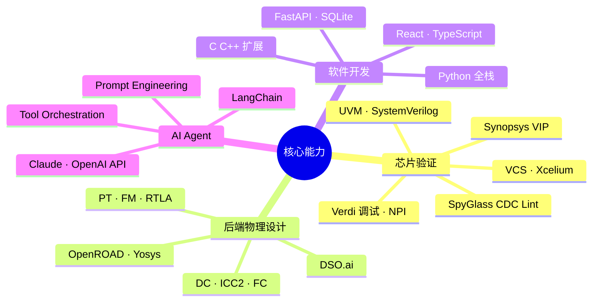
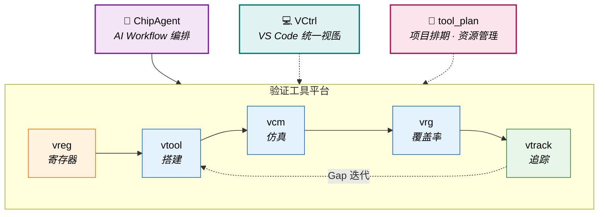
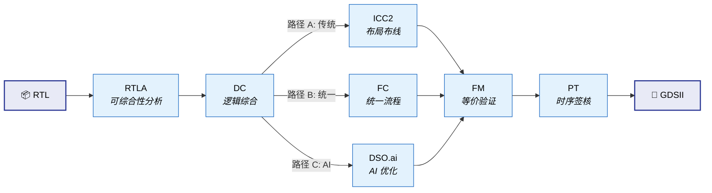

# 👋 你好，我是 John

**数字 IC 验证工程师 / Digital IC Verification Engineer**

杭州 · 5 年经验 · Hangzhou · 5 Years Experience

*用 UVM 验证芯片，用 Python 造工具，用 AI 探索 EDA 新范式*

---

## 关于我

我是一名数字 IC 验证工程师，日常工作围绕 SoC 芯片的功能验证展开——搭建 UVM 环境、编写测试用例、执行回归仿真、推动覆盖率收敛，以及定位和修复设计缺陷。

在完成验证主业的同时，我持续投入两个方向的探索：

1. **全栈工具链开发**：针对验证生命周期中的效率瓶颈，独立设计并落地了五套核心工具——VCM（仿真管理）、VRG（覆盖率分析）、vtrack（验证追踪）、VReg（寄存器平台）和 vtool（命令行工具集），覆盖了从仿真执行到追踪闭环的完整链路。
2. **AI 驱动的验证工作流**：在工具链的基础上，研发了终端 AI Agent 框架——ChipAgent。它将零散的命令行工具编排成 AI 可驱动的自动化流程，让"从 Spec 解析到环境搭建"可以通过自然语言对话完成。

此外，为了建立从 RTL 到 GDSII 的全局物理视野，我自建了一套覆盖综合、布局布线与签核的完整后端流程框架（chip_flow），并在多个开源 SoC 上跑通验证。

> I am a Digital IC Verification Engineer building UVM testbenches and robust verification automation toolchains. Beyond traditional DV tasks, I have developed ChipAgent — an LLM-based agent framework that orchestrates fragmented EDA tools into AI-driven workflows, transforming chip verification from manual routines into intelligent, end-to-end conversations.

---

## 技术栈

<table>
<tr>
<td valign="top" width="50%">

**验证 / Verification**
- `UVM` (VCS / Xcelium) · `SystemVerilog` 断言 & 覆盖率
- Synopsys `Verdi` 调试 · NPI 编程接口
- Synopsys VIP (SVT APB/SPI Agent) · `OVL`
- `SpyGlass` Lint / CDC / Low Power

**后端 / Backend Flow**
- Synopsys: DC · ICC2 · FC · RTLA · PT · FM · DSO.ai
- Cadence: Innovus · Xcelium
- 开源: OpenROAD · OpenLane · Yosys

</td>
<td valign="top" width="50%">

**语言与开发 / Languages**
- `SystemVerilog` · `Verilog` · `Tcl` · `Shell`
- `Python` · `C/C++` · `TypeScript`
- `React` · `FastAPI` · `SQLite`
- `SystemRDL` · `ANTLR` · `LaTeX`

**AI 与 Agent / AI & Agent**
- `LangChain` · `Deep Agents` 生态
- `Claude` · `OpenAI` · `Google GenAI` 多模型接入
- YAML/Markdown 驱动的知识编排体系

</td>
</tr>
</table>

---

## 验证工具生态

从手动工具到前端视窗，再到 AI 编排——八套工具组成完整的验证自动化栈：

| 架构分层 | 核心组件 | 定位与核心职责 |
|---|---|---|
| **🤖 AI 编排层** | **ChipAgent** | AI 编排中心。通过结构化 Playbook 驱动底层工具，将验证任务串联成端到端的自动化流程。 |
| **💻 视窗交互层** | **VCtrl** | IDE 控制台。以 VS Code 扩展形式，将分散的命令行工具统一为可视化交互界面。 |
| **📅 项目管理层** | **tool_plan** | 排期管理平台。多产品线项目排期、资源负载分析与 Jira 工时对比，单二进制部署。 |
| **🔗 需求追踪层** | **vtrack** | 验证追踪系统。管理 Feature → VP → Case 三层追溯链路，提供缺口分析与覆盖率同步。 |
| **📋 资产定义层** | **vreg** | 寄存器管理平台。可视化编辑寄存器定义，自动检测位域冲突，一键生成 RTL / UVM / C 代码。 |
| **🛠️ 开发脚手架层** | **vtool** | 命令行工具集。覆盖 UVM 骨架生成、代码检索、回归用例扫描与 Bug 报告导出。 |
| **📊 执行调度层** | **vcm** | 仿真管理系统。统管单次仿真与 SLURM 集群回归，处理多工艺角 EMC 自动化构建。 |
| **📈 覆盖分析层** | **vrg** | 覆盖率分析引擎。通过 C 层引擎直接解析 VDB，实现用例级覆盖率归因与冗余识别。 |

---

### 🤖 ChipAgent — AI 驱动的 EDA 终端助手

ChipAgent 是专为芯片设计全流程打造的终端 AI 助手，基于 Deep Agents（LangChain 生态）构建，可部署在网络隔离的 EDA 服务器上。与通用编程助手不同，它聚焦芯片设计中**可规范化、可重复执行的流程任务**——仿真调试、逻辑综合、日志分析、环境搭建、EDA 知识问答——将标准化操作流程沉淀为 AI 可驱动的知识结构。项目规模 3.1 万余行，含 19 个核心组件与 1911 个测试用例。

| 核心特性 | 说明与价值 |
|---|---|
| **三层 EDA 知识体系** | YAML/Markdown 驱动的"岗位 → 事项 → 知识"三层模型，将 EDA 经验结构化为 AI 可检索、可执行的知识库 |
| **原生 CI 集成** | 支持嵌入自动化脚本，可无缝融入已有仿真流水线 |
| **安全与权限把控** | 四级风险划分，结合 LLM 分类器与"人类在环（HITL）"审批机制 |
| **跨层记忆系统** | 项目级、用户级、会话级三层记忆，支持 AI 跨会话知识迁移与事后复盘 |

---

### 🛠️ 验证底层平台 (Tool Platform)

五个底层工具系统既服务于工程师日常操作，也作为 Native Tools 供大模型自主调用——"人机共用"的设计让工具链天然具备 AI 就绪能力。

#### 🔗 vtrack — 验证需求追踪系统

基于 Feature → VP → Case 三层模型，在功能需求与测试执行之间建立完整的可追溯链路，是验证闭环的"最后一公里"。

| 核心特性 | 说明与价值 |
|---|---|
| **层次化追踪** | Feature → VP → Case 多对多追溯映射 |
| **覆盖率同步** | 对接 VCM 仿真结果与 VRG 覆盖率，自动同步数据 |
| **GAP 缺口分析** | 识别未覆盖功能点、缺失用例及失败测试，支持多级过滤 |
| **矩阵与快照** | 三维追踪矩阵 + 验证快照，监控收敛趋势 |

#### 📋 vreg — 全功能寄存器管理平台

寄存器定义、管理与多格式代码生成的一站式平台——从一份定义出发，同步产出 RTL、UVM 和 C 驱动代码。

| 核心特性 | 说明与价值 |
|---|---|
| **全栈式前后端** | React + Vite 可视化编辑，FastAPI + SQLite 后端 API 与权限管理 |
| **多态生成引擎** | 内嵌 SystemRDL 编译器，一键输出 UVM Model、RTL、C Header 及覆盖率模型 |
| **重叠位域检测** | 自动校验地址与位域冲突，支持 32/64 位并发锁定 |
| **Excel 互通** | 支持含宏定义的复杂 Excel 导入导出 |

#### 🛠️ vtool — DV 命令行工具集

部署于 EDA 服务器的一站式验证辅助工具，工程师日常最频繁使用的底层设施，也是 ChipAgent 调用最多的工具。

| 核心特性 | 说明与价值 |
|---|---|
| **UVM 骨架生成** | 一键生成模块/系统级验证环境及各类组件 |
| **回归用例管理** | 动态扫描用例，生成 EMC 回归列表，自动解析依赖并管理重跑 |
| **日志分析** | 识别仿真报错和断言触发，自动导出 Markdown Bug 报告 |
| **代码检索** | 全库搜索类名和层级，生成火焰图与静态参数 |

#### 📊 vcm — 验证用例管理系统

面向仿真全生命周期的管理系统，双模式架构（在线 Flask / 离线 SQLite）确保任何网络条件下可用。

| 核心特性 | 说明与价值 |
|---|---|
| **自适应双模式** | 在线连接 Flask API，离线降级本地 SQLite，自动切换 |
| **仿真全托管** | 自动采集编译日志、种子与通过状态，一键启动 Verdi 复现 |
| **集群回归** | Slurm 批量提交与轮询，汇总用例结果矩阵与异常报告 |
| **多工艺 EMC** | 管理多工艺角构建，自动执行编译与校验闭环 |

#### 📈 vrg — VDB 覆盖率分析引擎

直接读取 Synopsys VDB 二进制数据，跳过文本导出，实现无损覆盖率解析与用例级归因。

| 核心特性 | 说明与价值 |
|---|---|
| **VDB 二进制直读** | 通过 Synopsys C 库直接解析，无损提取全量覆盖率 |
| **用例级归因** | 量化各 case 覆盖率权重并识别冗余 |
| **七维覆盖率** | Line / Branch / Condition / Toggle / FSM / Assert / Group |
| **多源自适应** | 无 VDB 环境时自动切换 JSON 数据源，通过 vtrack 同步 |

#### 💻 VCtrl — VS Code 验证控制中心

VS Code 原生扩展，将验证工作流（vtool、vcm、vrg、vtrack）直接集成到编辑器中，以所见即所得的方式完成回归配置和追踪审查。

| 核心特性 | 说明与价值 |
|---|---|
| **全景仪表盘** | 实时展示用例统计、覆盖率、通过率与优先级状态 |
| **VPlan 视图** | 可视化缺口分析与追踪矩阵，Feature → Case 全链路追溯 |
| **仿真面板** | 实时监控仿真进度与集群状态，GUI 操作种子拉取 |
| **错误捕获** | 失败结果提取报错信息，一键重跑或启动 Verdi 调试 |

#### 📅 tool_plan — 项目排期管理平台

面向芯片团队的多产品线项目排期与资源管理系统（React 19 + FastAPI + SQLite），解决多项目并行时的资源分配、执行偏差追踪与数据驱动排期决策，单二进制部署开箱即用。

| 核心特性 | 说明与价值 |
|---|---|
| **人×周矩阵排期** | 评估/计划双模式，批量排期与冲突自动检测 |
| **执行分析** | 延期检测，对接 Jira 实现计划 vs 实际工时自动对比 |
| **资源热力图** | 负载可视化与可用性查询，部门/岗位/产品线多维统计 |
| **版本快照** | 发布冻结 + 版本间 diff 对比，排期历史可回溯 |
| **数据互通** | Excel 模板导入导出，Jira 工时同步，LDAP/AD 认证集成 |

---

## 更多效率工具

| 工具 | 功能 | 技术 | 应用场景 |
|------|------|------|------|
| **tool_cov** | Verdi/VCS 覆盖率提取 → Excel 报告 | NPI + Python | 周期性覆盖率汇报 |
| **tool_wave** | FSDB 波形读取 + 网表 signal driver/load 追踪 | Verdi NPI · C/S 架构 | 信号溯源调试 |
| **tool_soc** | IP-XACT SoC 自动互联 → RTL / C Header / Device Tree | Python 3.11+ | SoC 集成 |
| **tool_clkrst_network** | 时钟复位网络可视化设计 → Verilog 导出 | React + ReactFlow | 时钟树规划 |
| **tool_disasm_8051** | 8051 固件反汇编 · 跳转分析 · 内存利用率 | Python | 嵌入式固件分析 |
| **python_tool** | spec2rdl · spec2xlsx · json2docx · pinmux · IO list · 工时报告 | Python 脚本集 | 日常数据转换 |

---

## 后端全流程框架

### chip_flow

Makefile 驱动的 Synopsys 数字后端流程框架，覆盖 RTL 到签核全链路。搭建初衷是建立从逻辑设计到物理实现的全局理解。

| 维度 | 详情 |
|------|------|
| **工具覆盖** | RTLA → DC → ICC2 → FC → DSO.ai → FM → PT，共 7 个 Synopsys 工具 |
| **流程路径** | 路径 A (DC → ICC2)、路径 B (FC 统一)、路径 C (DSO.ai 优化) |
| **四层分离** | PDK / 设计 / 公共 / 工具脚本——支持 SAED32 / TSMC40 / SAED14 多工艺切换 |
| **验证实例** | 已在 servant (RISC-V) 和 m0plus_top (ARM) 上跑通全流程 |

---

## 开源项目

| 项目 | 描述 | 技术 |
|------|------|------|
| [hvp-language-support](https://github.com/Johnmc104/hvp-language-support) | VSCode 插件：层次化验证计划语法支持 | TypeScript |
| [sdc-xdc-support](https://github.com/Johnmc104/sdc-xdc-support) | VSCode 插件：SDC/XDC 时序约束支持 | TypeScript |
| [reg_tool_manage](https://github.com/Johnmc104/reg_tool_manage) | SystemRDL 寄存器管理与多格式代码生成 | Python |
| [sv_parser](https://github.com/Johnmc104/sv_parser) | 基于 ANTLR4 的 SystemVerilog 解析器 | Python · ANTLR |

---

## 🚀 未来焦点

1. **拓展 Agent 的能力边界**：从中小型模块级验证，向更大规模的异构 SoC 场景延伸——跨模块联调、多子系统并行验证。
2. **构建无人值守的闭环修复流**：深度耦合工具平台，实现"仿真报错 / 覆盖率缺口"场景下的 Debug → Fix → Verify 自动化循环。

---

*"用严谨的思路构建高品质环境，用智能的编排消散碎片化劳作"*

