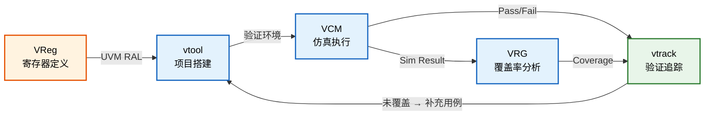

<div align="center">

# 👋 你好，我是 John

**数字 IC 验证工程师 / Digital IC Verification Engineer**

杭州 · 5 年经验 · Hangzhou · 5 Years Experience

*用 UVM 验证芯片，用 Python 造工具，用 AI 探索 EDA 新范式*

[](mailto:johnmc104@qq.com)
[](https://github.com/Johnmc104)

</div>

---

## 关于我

数字 IC 验证工程师，围绕 SoC 功能验证展开日常工作——搭 UVM 环境、写 case、跑回归、追覆盖率、定位 Bug。

在验证主线之外，我持续做两件事：

1. **造工具**：围绕验证全生命周期，开发了 VCM（仿真管理）、VRG（覆盖率分析）、vtrack（验证追踪）、VReg（寄存器平台）、vtool（命令行工具集）五套核心工具，覆盖从仿真执行到追踪闭环，已在团队日常使用。
2. **拉通全链路**：自建综合→布局布线→签核的完整后端流程框架（chip_flow），在多个 SoC 上跑通，加深对芯片从 RTL 到 GDSII 的全局理解。

最近在探索 LLM Agent 在芯片设计中的应用，独立开发了 ChipAgents 框架。

> I'm a DV engineer building UVM testbenches and a full verification automation toolchain (simulation management, coverage analysis, requirement traceability). I also built a complete RTL-to-signoff backend flow and am currently developing LLM agents for EDA.

---

## 技术栈

<table>
<tr>
<td valign="top" width="50%">

**验证 / Verification**
- `UVM` (VCS / Xcelium) · `SystemVerilog` 断言 & 覆盖率
- Synopsys `Verdi` 调试 · NPI 编程接口
- Synopsys VIP (SVT APB/SPI Agent) · `OVL`
- `SpyGlass` Lint / CDC / Low Power

**后端 / Backend Flow**
- Synopsys: DC · ICC2 · FC · RTLA · PT · FM · DSO.ai
- Cadence: Innovus · Xcelium
- 开源: OpenROAD · OpenLane · Yosys

</td>
<td valign="top" width="50%">

**语言与开发 / Languages**
- `SystemVerilog` · `Verilog` · `Tcl` · `Shell`
- `Python` · `C/C++` · `TypeScript`
- `React` · `FastAPI` · `SQLite`
- `SystemRDL` · `ANTLR` · `LaTeX`

</td>
</tr>
</table>

---

## 核心工具平台

我围绕验证全生命周期痛点，独立开发了五套核心工具，覆盖从仿真执行到覆盖率追踪闭环的完整链路：



### 📊 VCM — 验证用例管理系统

面向数字验证仿真流程的全生命周期管理系统。`v1.5.0`

| 架构 | 说明 |
|------|------|
| **存储** | 本地 SQLite + 远程 Flask API，按环境自动切换 |
| **CLI** | `vcm` 统一入口，10 大命令组：project / module / case / task / sim / regr / info / emc / db / init |
| **Web** | Flask + HTML 模板，仿真数据可视化与回归报告 |
| **集成** | Makefile 驱动：`make build_ssh → make regr → make check → make report` |

**典型场景：**
- **单次仿真**：`vcm task add` → `vcm sim add_basic_single` — 自动采集编译信息、仿真日志、种子、用例名、通过状态
- **集群回归**：Slurm 批量提交 → 状态查询 → 结果统计 → 报告生成
- **EMC 多 Build**：多工艺角 test-build 映射、编译命令自动获取
- **一键调试**：`vcm info sim <id>` 直接启动 Verdi

### 📈 VRG — VDB 覆盖率分析引擎

Synopsys VDB 覆盖率数据库的解析与报告工具，支持用例级覆盖率归因分析。

| 层 | 技术 | 能力 |
|----|------|------|
| **解析层** | C lib (Synopsys VDB API) | 直接读取 VDB 二进制数据库，零中间格式 |
| **接口层** | Python API (`VRGSession`) | 编程式访问，支持批量查询与脚本集成 |
| **报告层** | JSON / 文本 | 7 维覆盖率报告 + 用例级归因 |

**7 维覆盖率**：Line · Branch · Condition · Toggle · FSM · Assert · Group

**核心能力**：
- 按用例粒度归因覆盖率贡献，识别冗余 case
- 双数据源：VDB 直连 / JSON 报告，按环境自动切换
- 与 vtrack 联动：`vtrack sync vrg` 自动同步覆盖率至追踪系统

### 🔗 vtrack — 验证追踪管理系统

基于 Feature→VP→Case 三层模型的验证追踪工具，连接功能需求与测试执行的完整可追溯链路。

| 能力 | 说明 |
|------|------|
| **三层追踪** | Feature (功能点) → VP (验证点) → Case (测试用例)，支持多对多映射 |
| **功能组** | Feature 按 group 分组，支持按功能域聚合查看与分析 |
| **追踪矩阵** | 自动生成 Feature×VP×Case 覆盖矩阵，直观呈现验证进度 |
| **GAP 分析** | 识别未覆盖功能点、无用例 VP、失败用例，按优先级/功能组过滤 |
| **数据同步** | 对接 VCM 仿真结果 + VRG 覆盖率数据 (`sync vcm/vrg`) |
| **快照迭代** | 验证快照管理，追踪收敛趋势 |

**典型工作流**：
```bash
vtrack init pcie_ctrl --project GP28
vtrack feature add "LTSSM 状态机" --group "链路训练" --priority P0
vtrack vp add "状态遍历" --features F001 --method directed
vtrack case add "ltssm_walk" --vp VP001
vtrack matrix --group "链路训练"    # 追踪矩阵
vtrack gap --priority P0           # 覆盖率缺口
```

支持 Human / JSON / YAML 多格式输出，同时服务于工程师手动操作和 ChipAgent AI 工具调用。

### 📋 VReg — 寄存器管理与代码生成平台

芯片寄存器定义、管理与多格式代码生成的一站式平台。

| 层 | 技术 | 能力 |
|----|------|------|
| **前端** | React + Vite | 多项目管理、可视化编辑、Markdown 文档、全局搜索、批量地址编辑 |
| **后端** | FastAPI + SQLite | RESTful API、JWT 三级权限、版本锁定防并发 |
| **生成引擎** | Python + SystemRDL | SystemRDL · UVM Model · RTL · C Header · Config · Functional Coverage |

支持 Excel 导入（智能解析宏定义/数组/版本）、地址重叠/位域冲突校验、32/64 位自定义位宽。

### 🛠️ vtool — DV 命令行工具集

部署于 EDA 服务器的一站式验证辅助工具，统一入口 `vtool -<option>`。

| 功能 | 命令 | 说明 |
|------|------|------|
| 项目脚手架 | `-init bt\|st` | 一键生成模块级 / 系统级 UVM 项目结构 |
| 组件生成 | `-c agent\|tvc\|env\|tmc\|tms` | 自动创建 UVM Agent / TVC / Env 等组件 |
| 回归管理 | `-testlist` · `-emc` · `-check` | case 扫描 → 回归配置 → 日志/timing 检查 |
| 日志分析 | `-log` · `-bug` | 仿真日志检查 + Markdown Bug 报告（含 seed/git） |
| Case 索引 | `-findsw` | 全量扫描 UVM case，按 group/case/class 索引 |
| 调试 | `-tarmac fg` | tarmac.log → 火焰图 SVG |
| 设计辅助 | `-inst` · `-port` · `-power` | 模块例化 / IO List / FSDB 功耗分析 |

内置 svlib + OVL 库引用。

---

## 更多效率工具

| 工具 | 功能 | 技术 |
|------|------|------|
| **tool_cov** | Verdi/VCS 覆盖率提取 → Excel 报告 | NPI + Python |
| **tool_wave** | FSDB 波形读取 + 网表 signal driver/load 追踪 | Verdi NPI · C/S 架构 |
| **tool_soc** | IP-XACT SoC 自动互联 → RTL / C Header / Device Tree | Python 3.11+ |
| **tool_clkrst_network** | 时钟复位网络可视化设计 → Verilog 导出 | React + ReactFlow |
| **tool_disasm_8051** | 8051 固件反汇编 · 跳转分析 · 内存利用率 | Python |
| **python_tool** | spec2rdl · spec2xlsx · json2docx · pinmux · IO list · 工时报告 | Python 脚本集 |

---

## 后端全流程框架

### chip_flow

Makefile 驱动的 Synopsys 数字后端流程，覆盖 RTL 到签核，用于拉通全链路理解。

- **7 工具**：RTLA → DC → ICC2 → FC → DSO.ai → FM → PT
- **3 条路径**：DC→ICC2→FM→PT / FC 统一 / DSO 优化
- **4 层分离**：PDK / 设计 / 公共 / 工具脚本 — 支持 SAED32 / TSMC40 / SAED14 多工艺
- 已在 servant (RISC-V)、m0plus_top (ARM) 上验证全流程

---

## AI Agent 探索

**ChipAgents** — 面向 EDA 服务器的终端 AI Agent（独立开发）
- LangChain Deep Agents · Position → Playbook → Skill 三层知识模型 · 强弱模型分层 · 项目记忆持久化
- 内置 vtrack / VCM / VRG 工具集成，AI 驱动的验证追踪与仿真分析
- 终端交互式 AI 助手，面向仿真调试、逻辑综合、日志分析、环境搭建、EDA 工具知识问答。

### 定位：规范化流程任务，而非通用深度研究

Claude Code、GitHub Copilot 等通用 Agent 适合开放式的编码探索和深度研究。ChipAgent 的目标不同——**专注于芯片设计中可以规范化、可重复执行的流程任务**。

| | 通用 Agent (Claude Code / Copilot) | ChipAgent |
|--|-------------------------------------|-----------|
| **擅长场景** | 开放式编码、深度研究、跨领域探索 | EDA 规范化流程：仿真调试、综合分析、日志排查 |
| **部署环境** | 需要完整开发环境 | 终端单一二进制，部署于网络隔离的 EDA 服务器 |
| **CI 集成** | 需额外适配 | 原生管道模式 `-c "查询" -e -o report.md` |
| **成本控制** | 依赖单一强模型（Opus 级每小时数十美金） | strong/fast 模型分层，轻量阶段自动切换低成本模型 |
| **领域知识** | 依赖 prompt 手动注入 | 三层知识体系（岗位→事项→知识）自动加载 EDA 领域上下文 |
| **流程驱动** | 自由对话 | Playbook 阶段编排，结构化引导执行 |
---

## 开源项目

| 项目 | 描述 |
|------|------|
| [hvp-language-support](https://github.com/Johnmc104/hvp-language-support) | VSCode 插件：层次化验证计划语法支持 (TypeScript) |
| [sdc-xdc-support](https://github.com/Johnmc104/sdc-xdc-support) | VSCode 插件：SDC/XDC 时序约束支持 (TypeScript) |
| [reg_tool_manage](https://github.com/Johnmc104/reg_tool_manage) | SystemRDL 寄存器管理流程 (Python) |
| [sv_parser](https://github.com/Johnmc104/sv_parser) | 基于 ANTLR 的 SystemVerilog 解析器 |

---

## 技术写作

基于 LaTeX (elegantbook) 编写：

**书籍**：SoC 功能验证 · ASIC 设计与综合 · 低功耗与存储管理 · ECC 密码学 · 物理设计

**手册**：Design Compiler · Fusion Compiler · 数字验证 · Git 工作流 · Tcl Workshop

---

## 当前方向

- LLM Agent 在芯片验证与 EDA 自动化中的落地
- 验证追踪闭环：从功能点定义到覆盖率收敛的全链路可追溯
- 覆盖率驱动验证的工具化与可视化

---

<div align="center">

*"写好每一个 testcase，造好每一个工具"*

</div>
